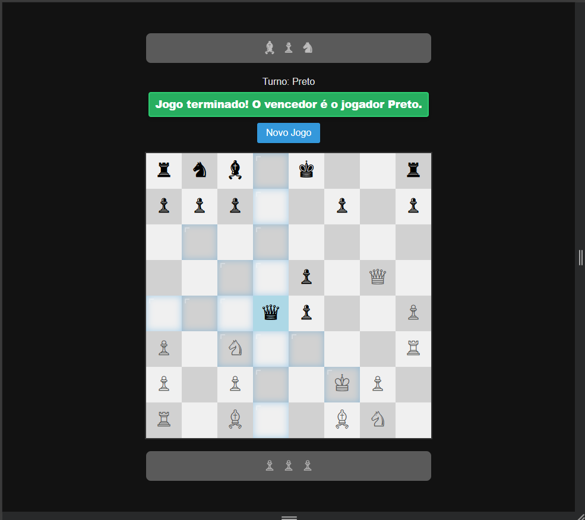

# Chess Master - Laravel & JS

Este é um jogo de xadrez funcional desenvolvido com Laravel 11 e JavaScript puro.

  

## Funcionalidades

-   **Lógica de Peças:** Movimentação validada para todas as peças.
-   **Destaque de Movimentos:** Visualização das casas possíveis ao clicar.
-   **Cemitério de Peças:** Acompanhamento de peças capturadas durante a partida.
-   **Interface Dark Mode:** Design moderno e confortável.

## Tecnologias

-   PHP 8.x / Laravel 11
-   JavaScript (Fetch API / DOM)
-   CSS3 (Flexbox/Grid)
-   Blade Templates
